<div align="center">
<h3 style="font-size: 22px">Adversarial Graph Neural Network Benchmarks<br> Towards Practical and Fair Evaluation</h3>
<!--  -->
</div>


## About the project
GAB is a benchmarking framework for evaluating adversarial attacks and defenses on Graph Neural Networks (GNNs) under standardized and rigorous experimental settings.

Our goal is to eliminate inconsistencies in prior evaluations by providing a unified framework that enables fair comparison across methods. We systematically re-evaluate widely used attacks and defenses under both poisoning and evasion scenarios across multiple graph datasets, revealing critical factors that significantly impact reported performance.

### Benchmarking Framework Highlights

- 🧪 Unified benchmark for adversarial GNN evaluation across diverse settings  
- 📊 Comprehensive study covering attacks, defenses, and multiple datasets  
- 🔍 Reveals hidden factors (e.g., node selection, training procedures) affecting robustness  
- ⚖️ Standardized protocols for fair and reproducible comparisons  
- 🚀 Scalable experimental pipeline (400K+ runs) for robust analysis


**To setup the environment, please check out [setup.md](doc/Set%20up.md)**

## Experiments
To run evaluation on adversarial attacks and defense. An example command can be used:
```
python experiments/adversarial_attack_evaluation.py --model=GCN --adversarial=l1d_rnd_attack 
```

### Custom args:
- `num_run` : define number of runs with different seed
- `num_split` : number of random split per dataset for evaluation 
- `purification` : select purification methods from [list of purifications.](#supporting-purification-methods)
- `config_setting`: Select either `best_config` or `default`. `best_config` use the best configuration of victim model selected from model selection.
- `model` : name of victim model selected from [list of models.](#supporting-victim-models)
- `adversarial` : name of adversarial attack selected from [list of adversarial attacks.](#supporting-adversarial-attacks)
- `evasion` or `no-evasion` : to perform evaluation in evasion setting (`True` or `evasion` by default)
- `poison` or `no-poison` : to perform evaluation in poison setting (`True` or `poison` by default)
- `use-node-degree` or `no-use-node-degree` : to perform evaluation with node degree as an extra criteria to select target node (`True` or `use-node-degree` by default)
- `dataset`: dataset to perform experience on, select from list of [supporting datasets.](#supporting-datasets)

## Model selection
To perform model selection, use `hyper_tuning_all_split.py` to perform hyperparameters search on GNN backbone. An example command as follows:

```bash
python experiments/hyper_tuning_all_split.py --model=GCN --dataset=cora
```

### Custom args:
- `dataset`: dataset to perform experience on
- `model` : name of victim model selected from [list of models.](#supporting-victim-models)

Or model selection on purification as follows:

```bash
python experiments/hyper_tuning_filter_all_split.py --model=GCN --dataset=cora --purification=GARNET
```

### Custom args:
- `dataset`: dataset to perform experience on
- `model` : name of victim model selected from [list of models.](#supporting-victim-models)
- `purification`: purification method from [list of models.](#supporting-purification-methods)

## Supporting Purification methods
| Method  | Paper |
|------------|------------|
| GARNET   |  [GARNET: reduced-rank topology learning for robust and scalable graph neural networks](https://arxiv.org/abs/2201.12741) |
| Jaccard   | [Adversarial Examples on Graph Data: Deep Insights into Attack and Defense](https://arxiv.org/abs/1903.01610)|

## Supporting Victim Models

| Method  | Paper |
|------------|------------|
| GCN   |  [GARNET: reduced-rank topology learning for robust and scalable graph neural networks](https://arxiv.org/abs/2201.12741) |
| GSAGE   | [Adversarial Examples on Graph Data: Deep Insights into Attack and Defense](https://arxiv.org/abs/1903.01610)|
| GIN   | [Adversarial Examples on Graph Data: Deep Insights into Attack and Defense](https://arxiv.org/abs/1903.01610)|
| PNA   | [Adversarial Examples on Graph Data: Deep Insights into Attack and Defense](https://arxiv.org/abs/1903.01610)|
| GRAND   | [Graph random neural networks for semi-supervised learning on graphs](https://arxiv.org/abs/2005.11079)|
| GCORN   | [Bounding the expected robustness of graph neural networks subject to node feature attacks](https://openreview.net/forum?id=DfPtC8uSot)|
| NoisyGNN   | [A simple and yet fairly effective defense for graph neural networks](https://arxiv.org/abs/2402.13987)|
| GNNGuard   | [GNNGuard: Defending Graph Neural Networks against Adversarial Attacks](https://arxiv.org/abs/2006.08149)|
| RobustGCN   | [Robust graph convolutional networks against adversarial attack](https://dl.acm.org/doi/10.1145/3292500.3330851)|
| ElasticGNN   | [Elastic graph neural networks](https://arxiv.org/abs/2107.06996)|
| RUNG   | [Robust graph neural networks via unbiased aggregation](https://arxiv.org/abs/2311.14934)|

## Supporting Adversarial Attacks

| Method  | Paper |
|------------|------------|
| Nettack   |  [Adversarial attacks on neural networks for graph data](https://arxiv.org/abs/1805.07984) |
| FGA   | [Fast gradient attack on network embedding](https://arxiv.org/abs/1809.02797)|
| SGA   | [Adversarial attack on large scale graph.](https://arxiv.org/abs/2009.03488)|
| GOttack   | [GOttack: Universal Adversarial Attacks on Graph Neural Networks via Graph Orbits Learning](https://openreview.net/forum?id=YbURbViE7l)|
| PR-BCD    | [Robustness of Graph Neural Networks at Scale](https://arxiv.org/abs/2110.14038)|
| PGD    | [Topology attack and defense for graph neural networks: An optimization perspective](https://arxiv.org/abs/1906.04214)|
| L1D-RND    | [Adversarial Graph Neural Network Benchmarks: Towards Practical and Fair Evaluation](https://openreview.net/forum?id=ZTFbk7e3SN)|

## Supporting datasets

| Dataset Name        |
|---------------------|
| citeseer            |
| citeseer_full       |
| cora                |
| cora_ml             |
| cora_full           |
| amazon_cs           |
| amazon_photo        |
| coauthor_cs         |
| coauthor_phy        |
| polblogs            |
| karate_club         |
| pubmed              |
| flickr              |
| blogcatalog         |
| dblp                |
| acm                 |
| uai                 |
| pdn                 |
| Roman-empire        |
| Amazon-ratings      |
| Minesweeper         |
| Tolokers            |
| Questions           |
| chameleon           |
| crocodile           |
| squirrel            |

and [OGB dataset](https://ogb.stanford.edu/).


## Tool
### Orbit discovery
GOttack requires precompute orbit discovery on the dataset, PyORCA is available in `utility`. Please check out [PyORCA Github](https://github.com/qema/orca-py) for setting up instruction.


## Reference


**Our adversarial benchmark is built upon [GreatX](https://github.com/EdisonLeeeee/GreatX) and [DeepRobust](https://github.com/DSE-MSU/DeepRobust). We appreciate their contribution to graph adversarial learning.**


